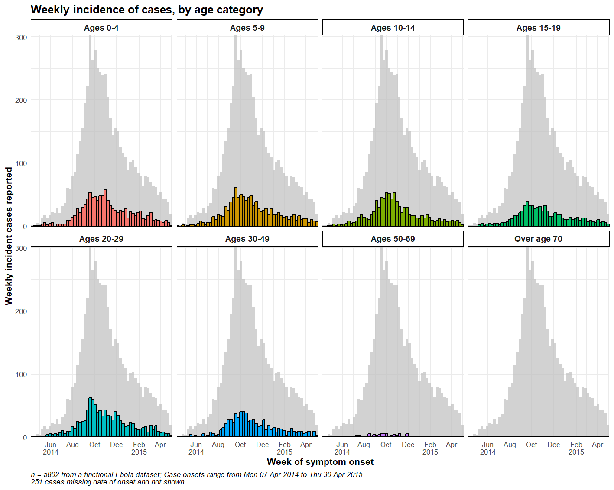
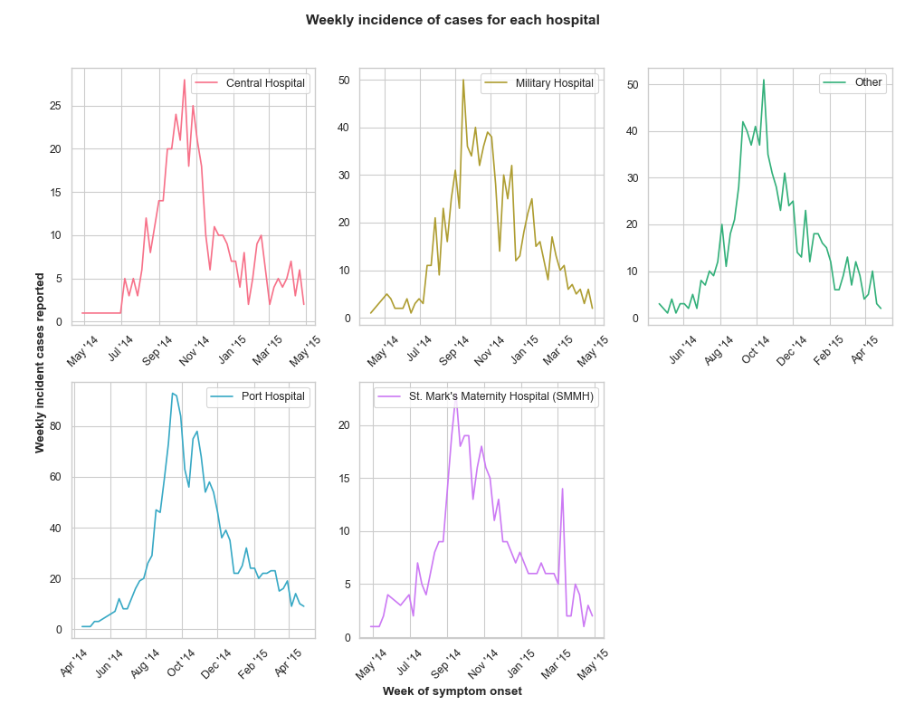
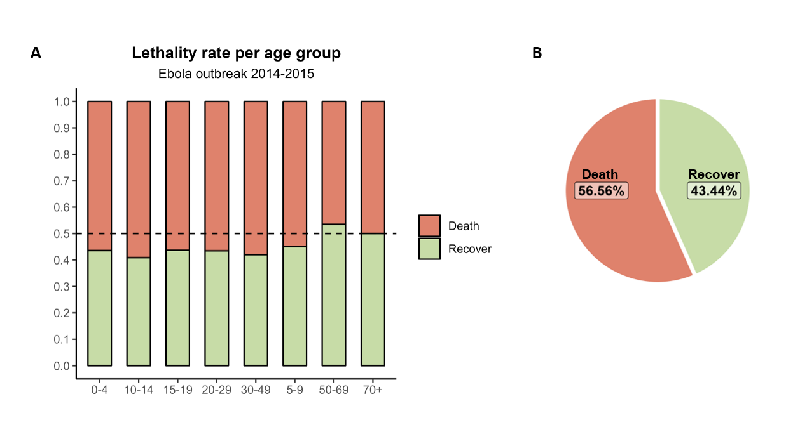

# Data visualization for life science course 2023

Some description \## Group assignment

-   Luong Nguyen Thanh

-   Marta Rubies Bedos

-   Urška Kašnik

-   Phatthranit Phattharapornja

## Dataset used

We used a fictional Ebola outbreak dataset, which has been published in [The EpiRhandbook](https://epirhandbook.com/en/download-handbook-and-data.html)

Our aim is to visualize the epidemiological trend of a finctional Ebola outbreak, and show which age group is most affected

## Data visualization

We created DatViz for three different audiences:

### Scientific figure for publication & to present at a conference

Weekly incidence of cases by age category, generated by R code

Weekly incidence of cases by hospital, generated by Python code

### Scientific figure for conference
We envision these figures to be presented at a conference targeted at medical staff.

Fig1. Ebola disease outcome during the 2014-2015 outbreak. a) Percentage of deceased and recovered patients after disease occurrance. b) Percentage of deceased and recovered patients per age group.

Fig2. Days between disease onset and hospitalization. Patients that are hospitalized on later days after disease onset have a higher chance of recovery.

### Visualisation for lay audience (SciComm, Twitter, local newspaper)

